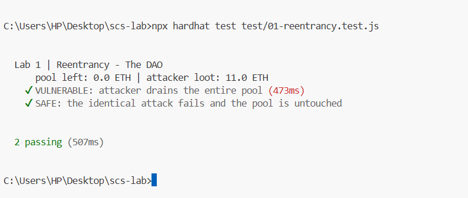
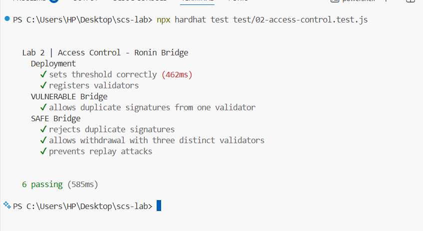
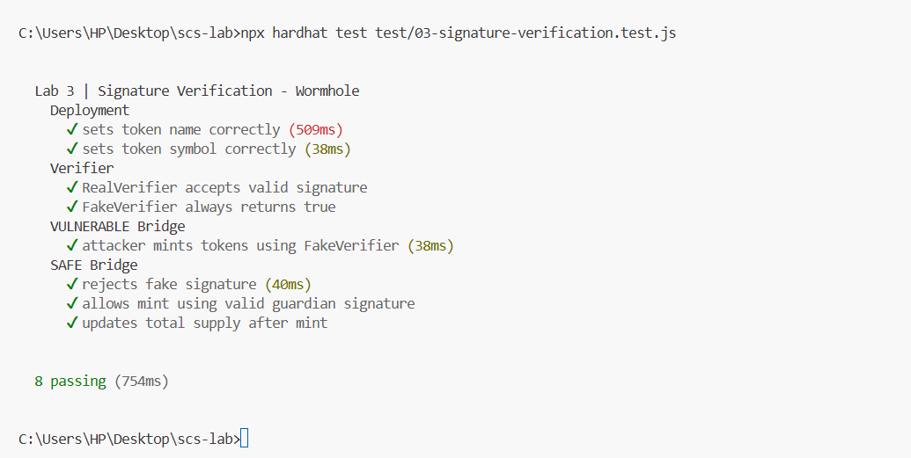
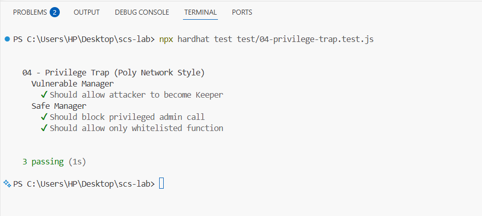

# Smart Contract Security — Hands-On Hack Labs

Four self-contained labs that **reproduce famous smart-contract hacks**, then **fix them**.
Each lab has a vulnerable contract, an exploit, a patched version, and a test that proves
the exploit works on the vulnerable code and is blocked on the fixed code.

> Educational use only. Everything runs on Hardhat's local, in-memory blockchain.
> No real funds, no mainnet, no live systems are involved. The goal is to learn to
> recognise and remediate these bug classes — the core skill of a security auditor.

## The four labs

| #   | Lab                         | Real incident               | Bug class                    | Key fix                                         |
| --- | --------------------------- | --------------------------- | ---------------------------- | ----------------------------------------------- |
| 1   | `01-reentrancy`             | The DAO (2016, ~$60M)       | Reentrancy                   | Checks-Effects-Interactions + `ReentrancyGuard` |
| 2   | `02-access-control`         | Ronin Bridge (2022, ~$625M) | Access control / key custody | Distinct-signer check (+ off-chain key custody) |
| 3   | `03-signature-verification` | Wormhole (2022, ~$320M)     | Trusting an unverified input | Fix the trusted verifier at deploy time         |
| 4   | `04-privilege-trap`         | Poly Network (2021, ~$610M) | Over-privileged executor     | Whitelist target + selector; separate privilege |

## Requirements

- Node.js 18+ and npm
- Internet access for the **one-time** `npm install` (downloads Hardhat + OpenZeppelin)

## Setup & run

```bash
npm install          # one-time
npm run compile      # compile all contracts
npm test             # run all four labs
```

Run a single lab:

```bash
npm run test:reentrancy
npm run test:access
npm run test:signature
npm run test:privilege
```

Expected output: each lab prints a "VULNERABLE" test where the exploit **succeeds**
and a "SAFE" test where the same attack **reverts**. Labs 2 also includes a lesson
test showing that even correct code cannot stop stolen distinct validator keys.

## How to teach each lab (suggested 1-hour flow)

1. **Read the vulnerable contract** — ask students to spot the flawed line.
2. **Run the VULNERABLE test** — watch the exploit drain / mint / take over.
3. **Read the fix** — diff the safe version against the vulnerable one.
4. **Run the SAFE test** — the same attack now reverts.
5. **Discuss** — map the bug to the security principle (see the slide deck).

## Lab notes

### 1 — Reentrancy (The DAO)

`VulnerableDAO.withdraw()` sends ETH **before** zeroing the balance. `Attacker.receive()`
re-enters `withdraw()` while the balance is still non-zero, looping until the pool is empty.
`SafeDAO` updates state first (Checks-Effects-Interactions) and adds `nonReentrant`.

### 2 — Access control (Ronin)

`VulnerableBridge` counts validator signatures **without checking they are distinct**, so one
compromised key signing 3× reaches the threshold. `SafeBridge` requires strictly increasing
signer addresses (forcing distinct signers). The final test shows the real Ronin lesson:
if an attacker steals `THRESHOLD` _distinct_ keys, correct code still cannot save you — the
remaining defences (decentralised operators, HSM custody, higher threshold, monitoring,
revoking stale allow-lists) live off-chain.

### 3 — Signature verification (Wormhole-class)

`VulnerableTokenBridge.mint()` trusts a **caller-supplied verifier address** as proof — mirroring
Wormhole trusting an unchecked, caller-supplied account. The attacker passes a `FakeVerifier`
that returns `true` and mints from nothing. `SafeTokenBridge` fixes the verifier at deploy time
(immutable), so a forged VAA fails. (Wormhole's real code is Solana/Rust; this is a faithful
Solidity analogue of the same "verify the thing you rely on" lesson.)

### 4 — Privilege trap (Poly Network)

`VulnerableManager.executeCrossChainTx()` will call **any** target with **any** calldata, and it
is the **owner** of `CrossChainData`. The attacker routes a call to the `onlyOwner` setter
`putCurEpochConPubKey` through the manager — the guard passes because the caller _is_ the owner,
making the attacker a keeper. `SafeManager` whitelists exactly which `(target, selector)` pairs
may be called, so admin functions are unreachable (separation of privilege).

## Directory layout

```
contracts/
  01-reentrancy/            VulnerableDAO.sol  Attacker.sol  SafeDAO.sol
  02-access-control/        VulnerableBridge.sol  SafeBridge.sol
  03-signature-verification/ Verifiers.sol  VulnerableTokenBridge.sol  SafeTokenBridge.sol
  04-privilege-trap/        CrossChainData.sol  VulnerableManager.sol  SafeManager.sol  Greeter.sol
test/
  01-reentrancy.test.js
  02-access-control.test.js
  03-signature-verification.test.js
  04-privilege-trap.test.js
```

## Test Results





